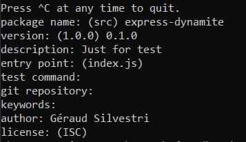

## Etape 1 : Mise en place du docker
Image utilisée : php:8.1.0-apache afin d'utiliser la dernière version disponible

Bootstrap utilisé pour le site static : https://startbootstrap.com/previews/stylish-portfolio

Pour lancer le conteneur, la commande suivante doit être utilisée:
```bash
docker build -t apache-php/static .
```
"apache-php/static" étant le nom du conteneur et le . se situant après indique que les fichiers manipulés par le dockerFile se trouvent dans le même répértoire que celui-ci.

Ensuite pour lancer le docker, il faut utiliser :

```bash
docker run -d -p 7070:80 apache-php/static
```

Remappant le port 7070 de la machine physique sur le port 80 de notre conteneur docker.

Au lancement du conteneur, on copie les fichiers du dossier src dans le dossier /var/www/html. Le dossier src contenant tout les fichiers nécessaires à la mise en place de notre site.

Pour accéder au site, il suffit de chercher "localhost:7070" sur le navigateur internet.

## Etape 2 : Mise en place de Node.js
Image utilisée : node:16.13.1

Après avoir créer le dockerfile, il faut créer le contenu dynamic. Premièrement il faut installer npm via la commande :

```bash
wsl sudo apt install npm
```

Ensuite il faut initialiser npm via la commande :
```bash
npm init
```

Une série d'informations est ensuite demandée



Les paramètres "test command", "git repository" et "keywords" ne sont pas utilisés. Pour "entry point" et "license", les valeurs par défaut sont gardées.

Suite à l'initialisation de npm, nous avons ajouter le module "[Chance.js](https://chancejs.com)". Après avoir crée un programme simple affichant des noms aléatoires (voir ledit programme ci-dessous), on peut en tester le fonctionnement en utilisant la commande :
```bash
node index.js
```
Code d'index.js
```js
var Chance = require('chance');
var chance = new Chance();

console.log("Bonjour " + chance.name());
```

Pour finir, une image docker est crée (voir étape 1) et nous pouvons lancer le programme via docker run.